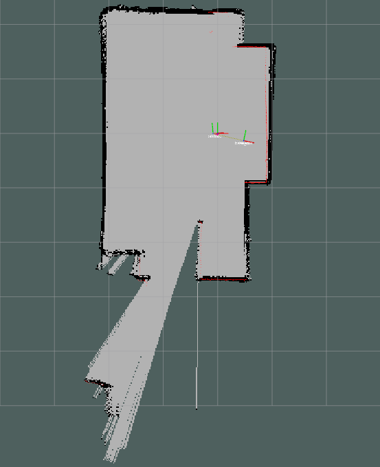

# Slam 

This project contains quick getting started for studying SLAM algorithm. The ROS version used is Melodic but Kinetic mays work too.

<p align="center">
  
</p>

In order to build this project, make a src directory in your workspace and clone this repository:

```
mkdir -p slam_ws/src & cd slam_ws/src
```

```
git clone https://github.com/tuanngo0898/slam.git
```

Or you can make your workspace yourself in src directory:
```
git clone https://github.com/ros-perception/slam_gmapping

git clone https://github.com/ros-perception/openslam_gmapping.git

git clone https://github.com/ccny-ros-pkg/scan_tools.git

git clone https://github.com/AndreaCensi/csm.git
```

Build the workspace:

```
catkin_make_isolated
```

Prepare for the eviroment:
```
source devel_isolated/setup.sh
```

Launch the demonstration:
```
roslaunch laser_scan_matcher demo_gmapping.launch
```

